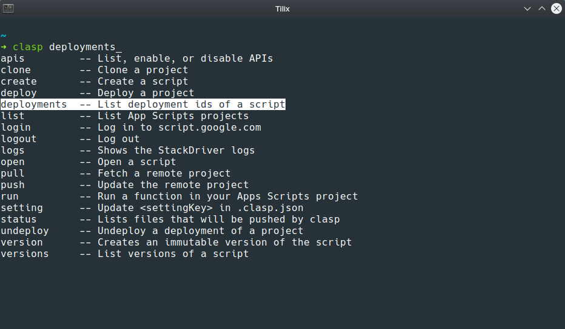

# CLASP Zsh AutoComplete


[](https://github.com/ellerbrock/open-source-badges/)
[](#)
[](https://twitter.com/VladoDev)

> 🔥 The plugin provides autocomplete for Google's Command Line Apps Script Projects CLI (clasp).

## :package: Installation

#### Oh-My-Zsh

1. Clone this repo into `$ZSH_CUSTOM/plugins`

   `git clone https://github.com/VladimirMikulic/clasp-zsh-autocomplete ${ZSH_CUSTOM:-~/.oh-my-zsh/custom}/plugins/clasp`

2. Add `clasp` to the list of plugins in your `.zshrc` file.

   `plugins=(... clasp)`

3. Start a new terminal session.

#### Manual (Git Clone)

1. Clone this repository somewhere on your machine.

   ```bash
   # This example clones the repo in ~/.clasp-zsh-autocomplete folder
   git clone https://github.com/VladimirMikulic/clasp-zsh-autocomplete ~/.clasp-zsh-autocomplete
   ```

2. Load the plugin by adding this to your `.zshrc`:

   ```bash
   # This line must come before autoload -U compinit & compinit commands
   fpath=(~/Desktop/clasp-zsh-autocomplete/ $fpath)
   ```

3. Start a new terminal session.

## :camera_flash: The plugin in action



## :man: Author

**Vladimir Mikulic**

- Twitter: [@VladoDev](https://twitter.com/VladoDev)
- Github: [@VladimirMikulic](https://github.com/VladimirMikulic)
- LinkedIn: [@vladimirmikulic](https://www.linkedin.com/in/vladimir-mikulic/)

## :handshake: Contributing

Contributions, issues and feature requests are welcome!

## :pencil: License

This project is licensed under [MIT](https://opensource.org/licenses/MIT) license.

## :man_astronaut: Show your support

Give a ⭐️ if this project helped you!
